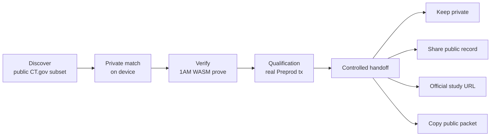
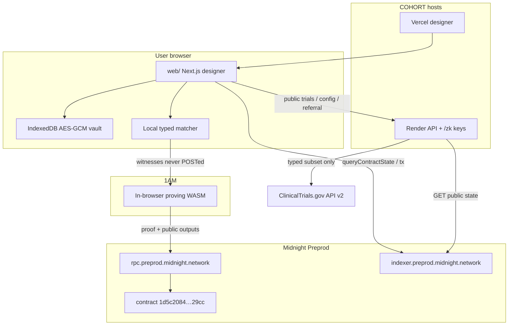
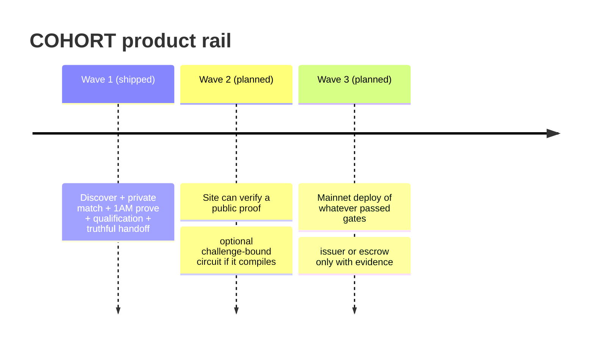

# COHORT

Prove clinical-trial eligibility on Midnight without handing over your medical record.

**Find trials you may qualify for. Check your fit privately. Prove it on Midnight. Choose what happens next.**

This directory is the application, Compact circuit, privacy tests, and live Preprod evidence. Operator setup is in `FINAL_SETUP.md` (local). The Wave 2 / Wave 3 roadmap is in `WAVES_2_3_MASTER_PLAN.md` (local). Among markdown files, **this README is the only document that ships to GitHub.**

---

## Why COHORT Exists

Clinical-trial recruitment still asks patients to hand a record to a vendor so a site can learn whether they even qualify. That is the wrong trust boundary. The patient learns nothing until PHI has already left the device. Sites drown in unqualified leads. Sponsors pay for screening that should have happened locally.

COHORT is a **privacy-preserving recruitment rail**, not a medical-records warehouse and not a ZK calculator:

**DISCOVER → PRIVATE MATCH → VERIFY → QUALIFICATION → CONTROLLED HANDOFF → REAL NEXT STEP**

Jay (Midnight workshop) named the healthcare marketplace job: discover, opt in, **selectively disclose a fact**. COHORT does that for typed trial eligibility. It does not certify that the patient’s facts are medically true. Sites still run their own screening.

---

## Why Privacy Changes the Product

A normal Web2 screener is a database with a form on top. The vendor sees age, condition flags, medications, and often a record dump, then tells the site “eligible.” That creates:

- a PHI store to breach
- a vendor who can lie about eligibility
- a patient who cannot prove fit without surrendering the record
- a site that cannot verify the claim without seeing the facts

COHORT inverts that. Typed trial rules stay **public**. Patient facts stay **on the device**. Midnight verifies the predicate. The public record is a nullifier, a referral commitment, and a counter. Sharing is a user choice of **public-safe** fields only. There is no live site inbox and no bounty.

Privacy here is not “one field is hidden.” It is **what an observer can correlate**: circuit name, contract, disclosed ledger writes, timing, and one-proof-per-trial uniqueness. Age and mapped flags are not among those writes.

---

## Why Midnight

Midnight is required because the product needs **private witnesses + public integrity** in one transaction:

| Primitive | How COHORT uses it |
|---|---|
| Dual-ledger | Public `spent` / `referrals` / `proven` vs witnesses that never leave the prover |
| Witnesses | `wAge`, `wCondition`, `wMedication`, `wSecret`, `wBlind` (`wSex` is declared and **unused**) |
| Circuits | `proveEligible` asserts typed bounds, then uniqueness |
| `disclose()` | Lets a hash cross into public ledger state. It does **not** publish the witness. Official Compact docs: disclose only allows a value to cross a public boundary |
| `persistentHash` / `persistentCommit` | Nullifier `H("cohort:ref", trialId, sk)` and referral commitment `Commit(sk, blind)` with a **fresh** blind |
| Indexer | Source of truth for `proven`, spent membership, and tx SUCCESS |

COHORT does **not** host a proof-server. Witnesses in the clear at a vendor prover would recreate the Web2 trust boundary.

Public-network pin (official support matrix, re-checked 2026-09-13 — Preview / Preprod / **Mainnet**, ledger 8):

| Component | Version |
|---|---|
| Compact compile | **0.31.1** |
| Compact language | **0.23** |
| compact-runtime | **0.16.0** |
| midnight-js | **4.1.1** |
| DApp Connector | **4.0.1** |
| wallet-sdk | **1.2.0 exact** |
| on-chain runtime | **3.0.0** |
| proof-server (Lace local only) | **8.1.0** |
| Indexer | Preview 4.3.5 / Preprod+Mainnet **4.3.3-hotfix** |
| Node | 1.0.2 |

Do **not** mix Compact 0.34 / language 0.26 / compact-runtime 0.19 / midnight-js 5.x `unwrapV9` / ledger 9 with Preview, Preprod, or Mainnet. Those are a different ledger. There is no ledger-8 → ledger-9 state migration. Re-read [the support matrix](https://docs.midnight.network/relnotes/support-matrix) before any future compile.

---

## Product Flow



1. **Discover** — recruiting studies from ClinicalTrials.gov API v2, filtered to a **hand-mapped typed subset**.
2. **Private match** — age and mapped flags stay in origin IndexedDB (AES-GCM). A local preview is only a **potential match**.
3. **Verify** — 1AM `connect('preprod')` in the Connect click → `getProvingProvider` → in-browser WASM → `submitCallTx`. COHORT never draws the 1AM Approve UI.
4. **Qualification** — verified means indexer `proveEligible` SUCCESS, not a UI badge.
5. **Handoff** — keep private / share `{trialId, txHash, contractAddress, networkId}` / continue to the official study / copy that public packet. There is no COHORT inbox and no paid bounty.

---

## Architecture



- Visual product: `web/` (Next.js) at `https://cohort-web-orcin.vercel.app`
- Same-origin stub + API: `apps/web` + `apps/api` at `https://cohort-y4zr.onrender.com`
- Circuit: `CONTRACT/cohort.compact` → `packages/contract`
- Non-visual DApp helpers: `packages/dapp`
- `npm test` includes a dependency-tree guard that fails if two `onchain-runtime-v3` versions appear

---

## Privacy Architecture

### PRIVATE (device only)

Age, mapped condition/medication flags, `wSecret`, `wBlind`, any FHIR paste parsed in-browser, the AES-GCM profile vault (`cohort-private-v1`, namespaced per wallet). Never POSTed. Never in `localStorage`.

### PUBLIC (ledger / indexer / optional share)

Entry point `proveEligible`, contract address, trial id (as a public circuit argument), nullifier inserted into `spent`, referral commitment inserted into `referrals`, `proven` counter, transaction hash/id, block time. Optional `POST /api/referral` may store only:

`trialId`, `commitment`, `txHash`, `contractAddress`, `networkId`, `nullifier`

Private field names (`age`, `condition`, `fhir`, `witness`, `secret`, `profile`, …) return **HTTP 400** and are not echoed.

### OFF-CHAIN allowed

Public ClinicalTrials.gov typed subset; public `/zk` proving/verifier keys (circuit keys, not seeds); indexer GraphQL; 1AM GraphQL (`api-preprod.1am.xyz`) for wallet session — **not** as the source of public-state truth.

`localStorage` may hold only `cohort.wallet.rdns`.

---

## Threat Model

| Adversary | What we defend | Residual / non-claim |
|---|---|---|
| Chain / indexer observer | No age or flags in ledger writes | Sees circuit name, contract, disclosed hashes, timing, uniqueness per trial |
| Compromised COHORT backend | Private POSTs 400; indexer is truth | Can lie about trial **metadata**; mitigate with NCT + ClinicalTrials.gov source URL |
| Malicious prover | Circuit `assert`s + `spent` uniqueness | Self-attested facts can be lies. We do not prove EHR authenticity |
| Malicious verifier / site | They only receive a public packet | Social engineering off-app |
| Replay | Nullifier `H("cohort:ref", trialId, sk)` in `spent` | Same secret + same trial cannot prove twice |
| Linkability across trials | Distinct nullifiers; fresh `wBlind` on referral commit | If `sk` leaks, all trials link. Keep `sk` in the vault |
| Hosted prover | Gold path is 1AM in-tab WASM | User-enabled 1AM Proof Station is UNKNOWN — disclose if used |
| Lace | Connect is allowed | No `getProvingProvider` → proving **LIMITED**, no fake tx |

We do **not** claim HIPAA compliance, 100% privacy, medical truth, or that `wSex` / `sexCriterion` is proven.

---

## Smart Contract

Live Preprod address:

`1d5c2084222c8abea80bc8228c0c743ca183138e52f404594caa28572e7c29cc`

`proveEligible` verifier (`midnight:verifier-key[v6]`) SHA-256:

`5af3b4b2ed345f711c5ff87367cfb0049732701c5a5336d51234b2a95fe32ab1`

Matches on-chain `ContractState.operation('proveEligible').verifierKey`, repo `packages/contract/zk`, and live `/zk`. **No cosmetic redeploy.**

### Circuit purpose

Prove a typed eligibility predicate for one trial, once per secret, and leave a public uniqueness token plus a blinded referral commitment.

### Public inputs

`trialId`, `minAge`, `maxAge`, `requireCondition`, `forbidMedication`

### Witnesses

| Witness | Used? |
|---|---|
| `wAge` | yes — `Uint<8>` bounds |
| `wSex` | **declared, unused** |
| `wCondition` | yes — if `requireCondition` |
| `wMedication` | yes — if `forbidMedication` |
| `wSecret` | yes — nullifier + commit |
| `wBlind` | yes — `persistentCommit` (must be fresh) |

### Public outputs / ledger

- `spent: Set<Bytes<32>>` — disclosed nullifier
- `referrals: Set<Bytes<32>>` — disclosed commitment
- `proven: Counter` — increment 1

### Nullifier

`persistentHash(["cohort:ref", trialId, sk])` — domain-separated, per trial.

### Replay protection

`assert(!spent.member(disclose(nul)))` then `spent.insert`.

### Non-claims

No escrow, no site inbox, no issuer signature, no `postTrial`, no sex check, no free-text protocol, no EHR authenticity.

---

## ClinicalTrials Integration

- Source: `https://clinicaltrials.gov/api/v2/studies`
- Hand-mapped NCT ids in `apps/api/src/trials.mjs` (`TRIAL_MAPPINGS`)
- Mapped: public min/max age, `sexCriterion` (displayed, **not proven**), sponsor-mapped condition/medication flags
- **Not** mapped into Compact: pregnancy, language, ECOG, QTc, washouts, anticoagulants, incision type, or any free-text inclusion/exclusion
- Why free-text is excluded: an LLM-to-Compact pipeline would invent constraints the circuit cannot honestly prove

Gold-path study used in live proves: **NCT07153614**.

---

## Wallet Architecture

| Wallet | Connect | Prove |
|---|---|---|
| **1AM** (`rdns` `com.midnight.1am`) | `connect('preprod')` in the user click | Gold path: `getProvingProvider` → WASM → `submitCallTx` |
| **Lace** | Connector v4, may connect | **LIMITED** — no `getProvingProvider`. Fail closed. Do not fake a proof. Local proof-server `8.1.0` is the user’s machine, not COHORT |

- Navbar **Connect wallet** opens a modal of discovered `window.midnight` injections. COHORT never CDP-clicks Connect (it poisons 1AM).
- Reload never fake-connects. It shows **Reconnect 1AM** / **Reconnect Lace**.
- Official DApp Connector has **no `disconnect()`**. App disconnect is local session teardown. It does **not** delete the encrypted profile.
- “Clear private data” clears the current wallet namespace only. 1AM vs Lace vaults are isolated.
- Seeds and viewing keys never touch COHORT.

---

## Proving Architecture

1. User gesture: Connect / Prove.
2. 1AM in-browser Halo2/BLS12-381 WASM (`@midnight-ntwrk/midnight-js-dapp-connector-proof-provider` on midnight-js **4.1.1**).
3. Public circuit keys from same-origin `/zk` (CORS `*` so 1AM can fetch). The hosted `.prover` file is a circuit proving key, **not a seed**.
4. `submitCallTx` to Preprod.
5. UI treats eligibility as verified only after indexer confirmation.

Witnesses never go to Render or Vercel. Do not stand up a COHORT-hosted proof-server.

---

## Backend

Render origin: `https://cohort-y4zr.onrender.com`

| Endpoint | Accepts | Rejects |
|---|---|---|
| `GET /health` | — | `{ "status": "ok" }` |
| `GET /api/config` | — | public network + contract address |
| `GET /api/trials` | — | typed subset + mapping disclaimer |
| `GET /api/trials/:id` | known NCT | 404 unknown |
| `GET /api/public-state` | — | last public referral events (no PHI) |
| `POST /api/referral` | public keys listed above | private fields **400**, extra keys **400** |
| `GET /zk/*` | public circuit artifacts | path escape **403** |

Privacy boundary: `assertPublicOnly` + `PUBLIC_REFERRAL_KEYS`. CORS allowlist includes the Vercel designer origin.

---

## Indexer / On-Chain Evidence

Contract (Preprod): `1d5c2084222c8abea80bc8228c0c743ca183138e52f404594caa28572e7c29cc`

Indexer GraphQL: `https://indexer.preprod.midnight.network/api/v4/graphql`

Explorer: [preprod.midnightexplorer.com](https://preprod.midnightexplorer.com/) · [1AM Preprod](https://explorer.1am.xyz/?network=preprod)

Latest recorded gold-path **browser** prove (2026-09-13, NCT07153614, user 1AM Approve — not CDP-clicked):

| Field | Value |
|---|---|
| txHash | `da8f79de04a120d7a0c8b433de992b21bee37a234b4af2c717aa16fb84fc1a60` |
| txId | `002000dc2327f9391931cb5747f2e1f36480bb948634913ddcacc411cddea0d31d` |
| Indexer after tx | **proven=6** / spentCount=6 / referralCount=6 |

Earlier real proves (do not treat Node SDK as the browser path):

| Path | txHash | then proven |
|---|---|---|
| Designer 1AM (utility-upgrade) | `97308434388cdba0a83eec487a1cee3645b7eead9c8836ce457c3de84132e1c8` | 5 (block 2524713) |
| Designer 1AM (honesty pass) | `40527ba6332a5953533d696c5ebc090ed1f168a84f00e53ac02d2251b68c4276` | 4 (block 2523970) |
| Designer 1AM | `0e8b61cbeb1d4b044743f8512b1d1bebb4d048d4dde091af5ce992ba701a4bd0` | 3 (block 2523192) |
| Same-origin stub 1AM | `3b1624e9cc8c17808f67cb5c52244f197fe57c0c820c75ef5beb7e18b8bf1590` | 2 |
| Node SDK (not browser gold path) | `00e53324…` | historical only |

---

## Deployment

| Surface | URL |
|---|---|
| Designer UI | https://cohort-web-orcin.vercel.app |
| API + stub | https://cohort-y4zr.onrender.com |
| Health | https://cohort-y4zr.onrender.com/health |
| GitHub | https://github.com/Mr-Ben-dev/COHORT |

Vercel project `cohort-web`, `rootDirectory` `web`, `NEXT_PUBLIC_COHORT_API_ORIGIN=https://cohort-y4zr.onrender.com`. Never put GitHub / Render / Vercel tokens in `NEXT_PUBLIC_` / `VITE_` vars.

Page CSP `connect-src` allows official Midnight indexer/RPC and 1AM GraphQL. Public-state truth stays `indexer.preprod.midnight.network`.

---

## Testing

Do **not** invent counts. Last recorded full suite:

| Suite | Recorded result | When |
|---|---|---|
| `npm test` (repo root, full suite) | **105 tests, 105 pass, 0 fail** | 2026-09-13, design/CI pass |
| Earlier full suite | 104/104 | wallet UX commit `7de94e5` |
| Hostile `POST /api/referral` `{age:31}` | 400, no echo of `31` | live Render, 2026-09-13 |
| Preprod indexer `queryContractState` + `ledger()` | `proven >= 2` assertion passes against the live contract | in-suite |
| On-chain verifier vs repo `zk` vs live `/zk` | byte-identical | in-suite |

The suite is a single `node --test` run covering the Compact circuit, the backend privacy gate, dependency-tree pinning, wallet/vault namespacing, live Render and indexer checks, and Playwright runs against both a local `next start` and production. `web/.next` must exist first (CI builds it; see `.github/workflows/test.yml`).

Contract tests cover Compact asserts, spent-set replay, and two-secret same-trial distinct nullifiers. Wallet tests cover Lace fail-closed proving, reconnect never fake-connected, disconnect keeps encrypted profile, 1AM vs Lace namespace isolation.

1AM Approve is a **manual** wallet click. Tests must not CDP-click Connect.

---

## Security / Privacy Verification

- Network: typed age never appears on Render or Vercel requests
- Storage: medical facts not in cookies / localStorage / URL
- Backend: private-field rejection with field names, no value echo
- Ledger: `ledger()` counters and spent set; witnesses absent
- Dependency pin: compact-runtime 0.16.0, midnight-js 4.1.1, wallet-sdk 1.2.0 exact, `onchain-runtime-v3` 3.0.0 via npm `overrides`
- Verifier key SHA-256 pin above

---

## Current Limitations

- Facts are **self-attested**. The circuit proves the predicate over witnesses, not that a hospital issued them.
- Typed subset only. Free-text protocol language is not proven.
- `wSex` is unused. Do not advertise sexCriterion as proven.
- No live site inbox. Sharing posts a public-safe record; it does not message a coordinator.
- No bounty / escrow. `referrals` is a uniqueness commitment, not a coin.
- Lace cannot prove on this gold path.
- IndexedDB vault is origin-scoped. Clearing site data destroys the profile. There is no server-side recovery.
- Preprod tNIGHT / DUST are test value. This is not Mainnet.
- 1AM vendor telemetry / Proof Station: **UNKNOWN**. Gold path assumes in-tab WASM.
- Gas sponsorship is **not documented**. Users need DUST.

---

## Wave 1 — What We Built

- Compact `proveEligible` on Preprod, address unchanged
- 1AM browser gold path with real indexer-confirmed transactions through **proven=6**
- ClinicalTrials.gov typed subset, honest mapping disclaimers
- Origin encrypted profile, per-wallet namespace
- Backend that refuses private fields
- Designer UI: Find Trials / My Profile / My Proofs
- Qualification handoff: keep / share public record / official study / public packet
- Landing copy that states the product in seconds, then the privacy boundary, then the non-claims

---

## Wave 2 — What We Will Build

Plan only (`WAVES_2_3_MASTER_PLAN.md`). **Not implemented in this commit.**

Deepen the two-sided rail without fake infrastructure:

- **Site verification console** — paste NCT + txHash; indexer confirms `proveEligible` SUCCESS. No inbox, no PHI.
- Optional **challenge-bound** circuit only if Compact 0.31.1 compiles it and 1AM can prove it (new address, Wave 1 contract kept as evidence).
- Issuer signatures only if `secp256k1EcdsaVerify` (or the then-current stdlib verify) compiles **and** 1AM WASM can prove it. Until then, keep saying self-attested.
- Richer typed matching still typed-subset only.

Explicitly not Wave 2: fake inbox, bounty, EHR authenticity, C2C, hosted prover, Mainnet.

---

## Wave 3 — Mainnet

Plan only. Re-read the official support matrix **the day implementation starts**. If Mainnet is still ledger 8 / Compact 0.31.1, deploy a **new Mainnet address** of the then-current circuit. Do not transplant Preprod state.

Then: production monitoring, incident rollback (UI prove flag off; contract is immutable), DUST documented as user-held, site console against the Mainnet indexer. Escrow and issuer credentials ship **only** with live cryptographic evidence.

---

## Roadmap



---

## Judge Quickstart

### A. Run it locally (no wallet needed for the first four steps)

Prerequisites: **Node 22+**, Chrome or Edge installed (Playwright drives the installed browser), git. No Docker, no proof-server, no database.

```bash
git clone https://github.com/Mr-Ben-dev/COHORT.git
cd COHORT

# 1. backend + circuit + test deps
npm ci

# 2. designer UI deps and production build
#    (the privacy suite starts `next start` against web/.next)
cd web && npm ci && npm run build && cd ..

# 3. full suite: contract, backend gate, vault, wallet, indexer, Playwright
npm test

# 4. backend + same-origin stub on http://127.0.0.1:10000
cp .env.example .env   # Preprod values; no secrets required to read public state
npm start
```

The designer UI runs separately:

```bash
cd web
npm run dev          # http://localhost:3000
# or serve the production build: npm start
```

`web` talks to `NEXT_PUBLIC_COHORT_API_ORIGIN` (defaults to the live Render API), the official Preprod indexer, and your wallet. Nothing private crosses those boundaries.

Inspect public chain state without any wallet:

```bash
curl https://cohort-y4zr.onrender.com/health
curl https://cohort-y4zr.onrender.com/api/config

# hostile request — must return 400 and must not echo 31
curl -X POST https://cohort-y4zr.onrender.com/api/referral \
  -H 'content-type: application/json' \
  -d '{"trialId":"NCT07153614","age":31}'
```

Read the contract's public counters straight from the official indexer:

```bash
curl -s https://indexer.preprod.midnight.network/api/v4/graphql \
  -H 'content-type: application/json' \
  -d '{"query":"{ contractAction(address: \"1d5c2084222c8abea80bc8228c0c743ca183138e52f404594caa28572e7c29cc\") { __typename address state transaction { hash applyStage } } }"}'
```

Compact toolchain (only needed to recompile the circuit — the repo ships the artifacts):

```bash
compact update +0.31.1
compact compile CONTRACT/cohort.compact packages/contract/managed
```

Do **not** install Compact 0.34 / midnight-js 5.x for this project. Those target ledger 9, which no public network runs.

### B. Run the real proof flow

Desktop Chrome, 1AM installed, Preprod synced with tNIGHT + DUST:

1. Open https://cohort-web-orcin.vercel.app — read the five-step product story under **The product**.
2. **Find Trials** → open a mapped study (NCT07153614) → **Check privately**. Facts stay local.
3. Navbar **Connect wallet** → 1AM. Click the 1AM toolbar and **Approve COHORT**. Do not expect an in-page Approve popup.
4. After SUCCESS, **My Proofs** shows a public-safe row (trial, shortened id, date — not age).
5. **What happens next?** — Keep private, share public qualification, continue to ClinicalTrials.gov, or copy the public packet.
6. Confirm chain truth: indexer `proven` / spent / referrals on contract `1d5c2084…29cc`. Hostile `POST /api/referral` with `{ "age": 31 }` must 400.

If 1AM opens balances instead of Approve: reload the extension at `chrome://extensions`, refresh COHORT, retry. The balance screen is not the connect dialog.

Lace may connect; proving stays limited.

---

## Evidence

| Item | Value |
|---|---|
| Designer | https://cohort-web-orcin.vercel.app |
| API health | https://cohort-y4zr.onrender.com/health |
| Contract | `1d5c2084222c8abea80bc8228c0c743ca183138e52f404594caa28572e7c29cc` |
| Latest browser txHash | `da8f79de04a120d7a0c8b433de992b21bee37a234b4af2c717aa16fb84fc1a60` |
| Latest browser txId | `002000dc2327f9391931cb5747f2e1f36480bb948634913ddcacc411cddea0d31d` |
| Indexer (as of that prove) | proven=6 spent=6 referral=6 |
| Verifier SHA-256 | `5af3b4b2ed345f711c5ff87367cfb0049732701c5a5336d51234b2a95fe32ab1` |
| Repo | https://github.com/Mr-Ben-dev/COHORT |

### Clean machine

Node **22+**. From this directory (no hosted proof-server, no Compact 0.34 / midnight-js 5.x / `unwrapV9`):

```
npm ci
npm test
```

Then install **1AM**, sync Preprod with tNIGHT + DUST, and open the designer URL above.
