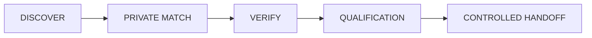
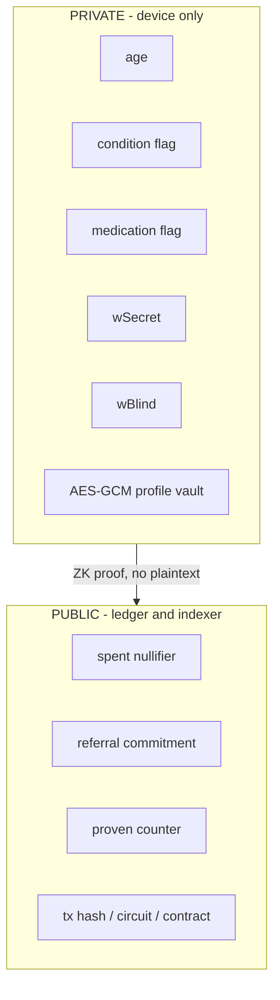
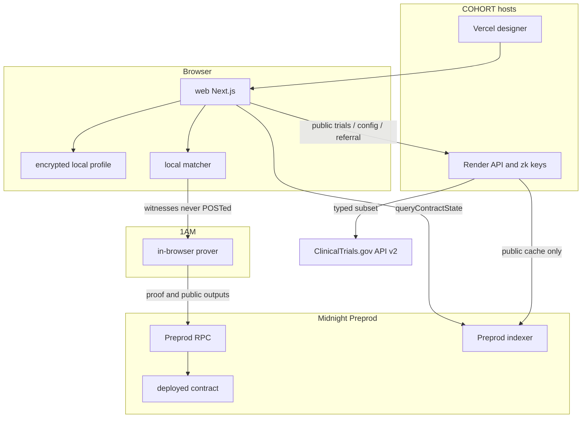
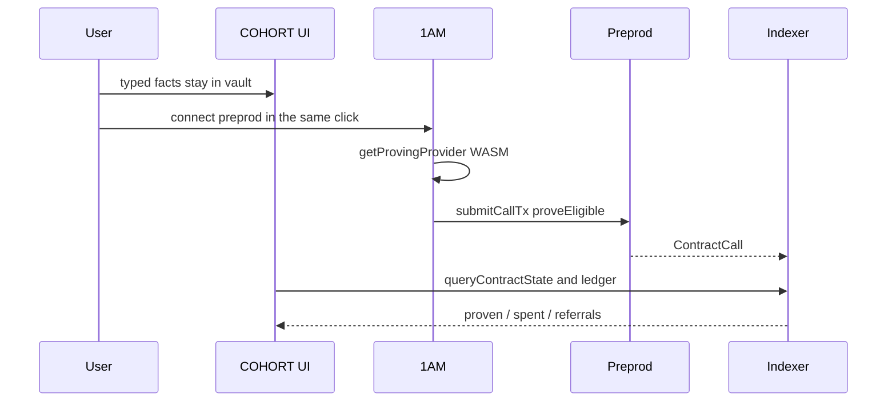
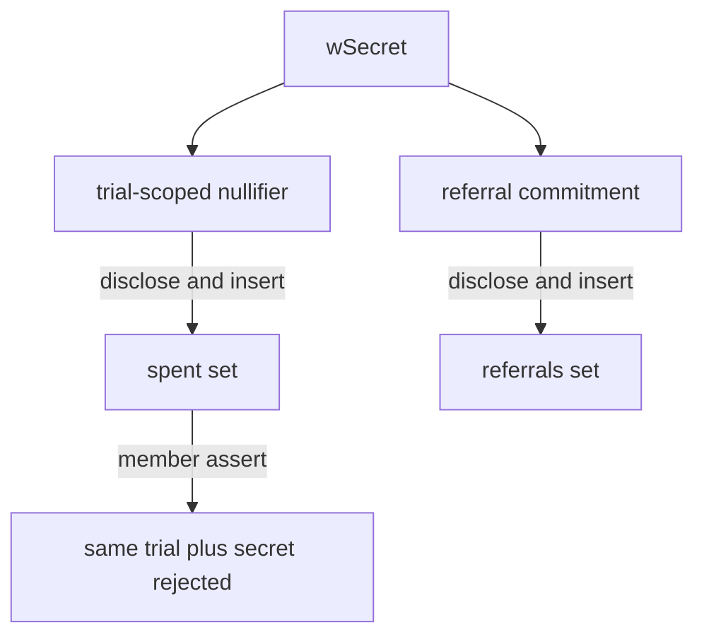
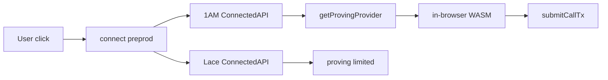
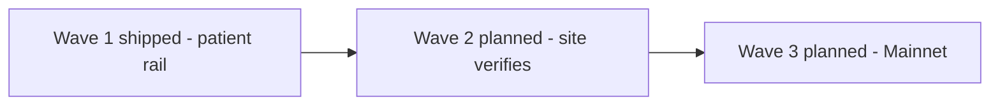

# COHORT

Prove a typed clinical-trial eligibility predicate on Midnight Preprod without handing over a medical record.

**Find trials you may qualify for. Check your fit privately. Prove it on Midnight. Choose what happens next.**

Live designer: [https://cohort-web-orcin.vercel.app](https://cohort-web-orcin.vercel.app)  
Public GitHub: [https://github.com/Mr-Ben-dev/COHORT](https://github.com/Mr-Ben-dev/COHORT)  
Wave 1 slides: [Google Slides deck](https://docs.google.com/presentation/d/1rh8v0kRFcEy3liyNkhEAiIQjt-M1qDuC/edit?usp=sharing&ouid=106789465777329337053&rtpof=true&sd=true)  
Demo video: [YouTube](https://youtu.be/PLnJ0M-3hxs)

## Contents

1. [COHORT in one minute](#1-cohort-in-one-minute)
2. [The problem](#2-the-problem)
3. [The solution](#3-the-solution)
4. [Product flow](#4-product-flow)
5. [Why Midnight](#5-why-midnight)
6. [Privacy model](#6-privacy-model)
7. [Threat model](#7-threat-model)
8. [System architecture](#8-system-architecture)
9. [End-to-end proof flow](#9-end-to-end-proof-flow)
10. [Compact contract](#10-compact-contract)
11. [Circuit semantics](#11-circuit-semantics)
12. [Public vs private state](#12-public-vs-private-state)
13. [Nullifier, commitment, replay protection](#13-nullifier-commitment-replay-protection)
14. [ClinicalTrials.gov integration](#14-clinicaltrialsgov-integration)
15. [Wallet architecture](#15-wallet-architecture)
16. [Backend privacy boundary](#16-backend-privacy-boundary)
17. [Deployment](#17-deployment)
18. [On-chain evidence](#18-on-chain-evidence)
19. [Tests and security](#19-tests-and-security)
20. [Judge quickstart](#20-judge-quickstart)
21. [Full Compact compile](#21-full-compact-compile)
22. [Judge verification CLI](#22-judge-verification-cli)
23. [Wave 1 — what is actually shipped](#23-wave-1--what-is-actually-shipped)
24. [Wave 2 — planned](#24-wave-2--planned)
25. [Wave 3 — planned](#25-wave-3--planned)
26. [Wave 1 scope](#26-wave-1-scope)
27. [Evidence links](#27-evidence-links)
28. [License](#28-license)

---

## 1. COHORT in one minute

COHORT is a privacy-preserving clinical-trial **recruitment rail**.

Public study rules come from ClinicalTrials.gov API v2, reduced to a **hand-mapped typed subset**. Patient facts stay on the device. Midnight verifies a Compact circuit, `proveEligible`, over those facts. The chain receives a trial-scoped nullifier, a blinded referral commitment, and a counter — not an age, not a condition flag, not a record.

The Wave 1 gold path is real: 1AM in-browser WASM proving, `submitCallTx` on **Preprod**, official indexer as truth. The contract was not redeployed for copy or UI work. Facts are **self-attested**. Sites still run their own screening.

| Item | Value |
|---|---|
| Network | Midnight Preprod (ledger 8) |
| Contract | `1d5c2084222c8abea80bc8228c0c743ca183138e52f404594caa28572e7c29cc` |
| Circuit | `proveEligible` |
| Compact | compiler **0.31.1**, language **0.23**, compact-runtime **0.16.0** |
| Verifier SHA-256 | `5af3b4b2ed345f711c5ff87367cfb0049732701c5a5336d51234b2a95fe32ab1` |
| Documented 1AM gold-path txHash | `da8f79de04a120d7a0c8b433de992b21bee37a234b4af2c717aa16fb84fc1a60` |
| Judge command | `npm run compile` then `npm test` then `npm run judge:verify` |

---

## 2. The problem

Clinical-trial recruitment still asks a patient to hand a record to a vendor so a site can learn whether they even qualify. That is the wrong trust boundary.

- The patient learns nothing until PHI has already left the device.
- The vendor accumulates a breach target.
- The site still has to read unqualified leads.
- Nobody in that loop needs the record to compute a typed eligibility predicate. They need one bit, plus a way to verify it.

A Web2 screener is a database with a form on top. The operator can see the facts, and the site has to trust the operator. That is not a recruitment rail. It is a PHI store.

---

## 3. The solution

COHORT inverts the boundary.

1. Trial policy stays **public** (typed age bounds and mapped flags from a ClinicalTrials.gov subset).
2. Patient facts stay **local** (AES-GCM IndexedDB, per-wallet namespace).
3. Midnight verifies the predicate in zero knowledge.
4. The public record is hashes and a counter.
5. The patient chooses a **truthful next step**. There is no live site inbox and no bounty.

Verified eligibility means: the official Preprod indexer reports `proveEligible` success against the deployed contract. It does not mean enrollment, medical truth, or HIPAA compliance.

---

## 4. Product flow



| Step | What the user does | What is private | What becomes public |
|---|---|---|---|
| Discover | Browse mapped recruiting studies | nothing required | NCT id, sponsor, typed bounds |
| Private match | Enter age / mapped flags locally | age, flags, vault | nothing |
| Verify | Connect 1AM, Approve in the toolbar | witnesses, WASM proof inputs | circuit name, contract, disclosed hashes |
| Qualification | See indexer-confirmed result | facts stay in the vault | tx hash/id, `proven++` |
| Handoff | Keep / share public packet / open official study | facts never posted | optional `{trialId, txHash, contractAddress, networkId}` |

Local preview is labeled **not a proof**. A green UI badge is not qualification. Qualification is an indexer-confirmed transaction.

---

## 5. Why Midnight

The product needs **private witnesses and public integrity in one transaction**. That is Compact’s job.

| Primitive | COHORT use |
|---|---|
| Dual ledger | Public `spent` / `referrals` / `proven` versus witnesses that never leave the prover |
| Witnesses | `wAge`, `wCondition`, `wMedication`, `wSecret`, `wBlind`. `wSex` is declared and **unused** |
| Circuit | `proveEligible` asserts typed bounds, then uniqueness |
| `disclose()` | Compiler acknowledgement that a **hash** may cross into ledger state. Official Compact docs: `disclose()` does not publish a value by itself; the value becomes public only when it crosses a ledger write / exported return |
| `persistentHash` | Trial-scoped nullifier `H(["cohort:ref", trialId, sk])` |
| `persistentCommit` | Referral commitment `Commit(sk, blind)` with a fresh blind |
| Indexer | Source of truth for counters and tx success |

COHORT does **not** host a proof-server. A vendor prover that sees witnesses in the clear recreates the Web2 trust boundary. 1AM proves in-browser. Lace may connect; it has no `getProvingProvider`, so proving is fail-closed.

Official public-network pin, re-checked 2026-09-16 against the [Midnight support matrix](https://docs.midnight.network/relnotes/support-matrix) (Preview / Preprod / **Mainnet**, ledger 8):

| Component | Version |
|---|---|
| Compact compile | **0.31.1** |
| Compact language | **0.23** |
| compact-runtime | **0.16.0** |
| Compact JS | 2.5.1 |
| midnight-js | **4.1.1** |
| DApp Connector | **4.0.1** |
| wallet-sdk | **1.2.0 exact** |
| on-chain runtime | **3.0.0** |
| proof-server image (Lace local only) | **8.1.0** |
| Indexer | Preview 4.3.5 / Preprod+Mainnet **4.3.3-hotfix** |
| Node | 1.0.2 |

Do **not** mix Compact **0.34** / language **0.26** / compact-runtime **0.19** / midnight-js **5.x** `unwrapV9` / ledger **9** with Preview, Preprod, or Mainnet. Those target a ledger that is not deployed on public nets. There is no ledger-8 → ledger-9 state migration. Re-read the matrix before any future compile.

---

## 6. Privacy model

Privacy here is **what an observer can correlate**, not whether one field is hidden.



| Location | Plaintext exists? | Over the network? |
|---|---|---|
| DOM / accessibility tree on the local device | yes, while the form is filled | no |
| IndexedDB `cohort-private-v1` AES-GCM, key `profile:<ns>` | ciphertext at rest | no |
| localStorage | only `cohort.wallet.rdns` | no medical facts |
| Render / Vercel HTTP | no — private field names return HTTP 400 | public trial metadata, `/zk` keys, optional public referral |
| 1AM WASM prover | witnesses in the wallet process | proof + public outputs to Preprod |
| Official indexer | disclosed ledger fields only | GraphQL public state |
| COHORT proof-server | **does not exist** | n/a |

`POST /api/referral` may store only: `trialId`, `commitment`, `txHash`, `contractAddress`, `networkId`, `nullifier`. Keys such as `age`, `condition`, `fhir`, `witness`, `secret`, `blind`, `profile` are rejected with **HTTP 400** and are not echoed.

Nullifiers are domain-separated with `pad(32, "cohort:ref")` plus `trialId`. A fresh `wBlind` is minted per proof so referral commitments do not collapse. Reusing a blind across trials collapses the public `referrals` set — Compact test I covers that, and the application mints a new blind.

What this does **not** claim: HIPAA, EHR authenticity, full-protocol eligibility, enrollment, zero metadata leakage, or 100% privacy. A chain observer still sees circuit name, contract, disclosed hashes, and timing.

---

## 7. Threat model

Aligned with Midnight’s three-adversary model ([security best practices](https://docs.midnight.network/guides/security-best-practices)):

| Adversary | What they see | COHORT control |
|---|---|---|
| Chain observer | entry point, contract, disclosed ledger writes, timing | only hashes and a counter are disclosed; age/flags are not ledger fields |
| Malicious prover | they choose every witness | circuit `assert`s are the only constraint; facts are self-attested |
| Off-chain operator | whatever you send them | backend allowlist; no witnesses on COHORT hosts; no hosted prover |

A lying prover can satisfy the circuit with invented age/flags. Wave 1 says that out loud. Issuer signatures are Wave 2/3 **gates**, not shipped features.

---

## 8. System architecture



| Tree | Role |
|---|---|
| `CONTRACT/cohort.compact` | Compact source |
| `packages/contract/zk/` | committed prover / verifier / ZKIR |
| `packages/contract/managed/cohort/contract/` | generated JS used by midnight-js |
| `packages/dapp/` | wallet, prove, indexer helpers |
| `apps/api/` | public API + privacy gate |
| `web/` | designer UI |
| `TESTS/` | `node --test` suite |
| `scripts/compile-contract.mjs` | full Compact compile |
| `scripts/judge-verify.mjs` | judge report |

`npm test` includes a dependency-tree guard: a second `@midnight-ntwrk/onchain-runtime-v3` version fails the suite.

---

## 9. End-to-end proof flow



1. Local witness object `{ age, condition, medication }` plus freshly minted `wSecret` / `wBlind`.
2. Compact circuit `proveEligible` with public args bound to `/api/trials` (user-typed bounds are rejected).
3. ZK proof in 1AM WASM (Halo2 / BLS12-381 via midnight-js **4.1.1** `dapp-connector-proof-provider`).
4. `submitCallTx` to Preprod.
5. UI waits for indexer confirmation. It does not invent a `txHash`.

---

## 10. Compact contract

| Field | Value |
|---|---|
| Path | `CONTRACT/cohort.compact` |
| `pragma language_version` | `0.23` |
| Compiler used to produce committed keys | **0.31.1** |
| Generated info | `packages/contract/zk/compiler/contract-info.json` |
| Circuits | one exported circuit, `proveEligible` (`proof: true`, `pure: false`) |
| Address | `1d5c2084222c8abea80bc8228c0c743ca183138e52f404594caa28572e7c29cc` |
| Why not redeployed | Wave 1 evidence is this address. Copy, UI, and documentation changes do not justify a new verifier |

Compile shape matches official hello-world: `compact compile <src> <out>` producing `compiler/`, `contract/`, `keys/`, `zkir/`. Do not use `--skip-zk`.

Witness `wSex` is declared in Compact and **absent** from generated `contract-info.json` witnesses — the compiler stripped it because the circuit never calls it. Do not advertise sexCriterion as proven.

---

## 11. Circuit semantics

```text
proveEligible(
  trialId: Bytes<32>,          // public
  minAge: Uint<8>,             // public
  maxAge: Uint<8>,             // public
  requireCondition: Boolean,   // public
  forbidMedication: Boolean    // public
): Boolean
```

| Witness | Used? | Role |
|---|---|---|
| `wAge(): Uint<8>` | yes | compared to `[minAge, maxAge]` |
| `wCondition(): Boolean` | yes | asserted if `requireCondition` |
| `wMedication(): Boolean` | yes | asserted false if `forbidMedication` |
| `wSecret(): Bytes<32>` | yes | nullifier + commitment material |
| `wBlind(): Bytes<32>` | yes | commitment blinding |
| `wSex(): Uint<8>` | **no** | declared, unused |

Assertions:

- `age >= minAge` (`"too young"`)
- `age <= maxAge` (`"too old"`)
- if `requireCondition`: `cond` (`"missing condition"`)
- if `forbidMedication`: `!med` (`"medication excluded"`)
- `!spent.member(disclose(nul))` (`"already proven this trial"`)

Ledger writes after the asserts:

- `spent.insert(disclose(nul))`
- `referrals.insert(disclose(referral))`
- `proven.increment(1)`
- return `true`

**Proves:** typed age bounds, mapped condition/medication flags versus public policy, trial-scoped nullifier uniqueness, referral commitment insert, counter increment.

**Does not prove:** medical-record authenticity, EHR/FHIR integrity, issuer attestation, `wSex`, pregnancy/ECOG/labs/washouts/language/geography/free-text criteria, unique-human (only uniqueness of `(wSecret, trialId)`), that public bounds match ClinicalTrials.gov (the application binds args to `/api/trials`; the circuit trusts those public args).

---

## 12. Public vs private state

| Public (ledger) | Private (witness / device) |
|---|---|
| `spent: Set<Bytes<32>>` | `wAge`, `wCondition`, `wMedication` |
| `referrals: Set<Bytes<32>>` | `wSecret`, `wBlind` |
| `proven: Counter` | AES-GCM profile, any FHIR paste parsed in-browser |
| circuit arguments (`trialId`, bounds, flags) | — |
| tx metadata | — |

`GET /api/public-state` is an in-memory **cache** of optional shares. Tests label it `notIndexerTruth`. `CohortDapp.getPublicVerification()` uses midnight-js `indexerPublicDataProvider.queryContractState` + generated `ledger()`.

---

## 13. Nullifier, commitment, replay protection



- Domain separation string `"cohort:ref"` prevents cross-protocol nullifier collisions with other DApps that hash a raw secret.
- Same secret + same `trialId` is Compact-F (`already proven this trial`). Compact test J: two secrets, same trial, `proven=2`, distinct nullifiers.
- Different `trialId` values produce distinct nullifiers for the same secret (test G).
- Application mints a new 32-byte secret/blind unless supplied. Live replay of a supplied secret remains a circuit reject, not a UI skip.

---

## 14. ClinicalTrials.gov integration

`GET /api/trials` pulls recruiting studies from ClinicalTrials.gov API v2 and keeps a **typed subset**: NCT id, sponsor, min/max age, mapped condition/medication flags, plus an explicit mapping disclaimer.

- Free-text inclusion/exclusion language is **not** compiled into Compact.
- Circuit args must match the served policy. `bindOfficialTrial` rejects user-typed bounds (`ErrorCode.UNSUPPORTED_CRITERIA`).
- Gold-path study used in live proves: **NCT07153614** (minAge 18, maxAge 80, requireCondition true, forbidMedication true).

This is not “the protocol, proven.” It is “the mapped subset, proven.”

---

## 15. Wallet architecture



- Discover `window.midnight`. No fake wallet tiles.
- 1AM (`rdns=com.midnight.1am`) is the gold path. Connect is **click-synchronous**. Approve is the **toolbar**, not an in-page popup. Tests must not CDP-click Connect.
- Lace may connect. Proving fail-closes. Do not proxy a hosted prover.
- Official DApp Connector has no `disconnect()`. App disconnect drops in-memory ConnectedAPI only.
- Vault keys `profile:<ns>` / `proofs:<ns>` from SHA-256(rdns + public address). Reload never fake-connects; it shows Reconnect.
- DUST `balance === 0n` fails closed with no invented `txHash`.

COHORT never draws the 1AM Approve UI and never hosts Proof Station.

---

## 16. Backend privacy boundary

Render origin: `https://cohort-y4zr.onrender.com`

| Endpoint | Accepts | Rejects |
|---|---|---|
| `GET /health` | — | `{ "status": "ok" }` |
| `GET /api/config` | — | public network + contract |
| `GET /api/trials` | — | typed subset + mapping disclaimer |
| `GET /api/trials/:id` | known NCT | 404 unknown |
| `GET /api/public-state` | — | last public referral events |
| `POST /api/referral` | public keys listed in §6 | private fields **400**, extra keys **400** |
| `GET /zk/*` | public circuit artifacts | path escape **403** |

`.prover` is a circuit proving key, not a wallet seed. `/zk` sends `Access-Control-Allow-Origin: *` so 1AM can fetch keys. Traversal of `/zk/../.env` is forbidden.

Page CSP `connect-src` allows official Midnight indexer/RPC and 1AM GraphQL. Public-state **truth** stays `indexer.preprod.midnight.network`.

---

## 17. Deployment

| Surface | URL |
|---|---|
| Designer UI | https://cohort-web-orcin.vercel.app |
| API + stub | https://cohort-y4zr.onrender.com |
| Health | https://cohort-y4zr.onrender.com/health |
| Public state cache | https://cohort-y4zr.onrender.com/api/public-state |
| GitHub | https://github.com/Mr-Ben-dev/COHORT |

Vercel project `cohort-web`, `rootDirectory` `web`, `NEXT_PUBLIC_COHORT_API_ORIGIN=https://cohort-y4zr.onrender.com`. Never put GitHub / Render / Vercel tokens in `NEXT_PUBLIC_` / `VITE_` variables.

---

## 18. On-chain evidence

Contract: `1d5c2084222c8abea80bc8228c0c743ca183138e52f404594caa28572e7c29cc`  
Indexer: https://indexer.preprod.midnight.network/api/v4/graphql  
Explorer: https://preprod.midnightexplorer.com/  
Verifier SHA-256: `5af3b4b2ed345f711c5ff87367cfb0049732701c5a5336d51234b2a95fe32ab1`  
On-chain verifier, repo `packages/contract/zk/keys/proveEligible.verifier`, and live `/zk` are byte-identical (`midnight:verifier-key[v6]:`).

**Primary documented browser gold path** (1AM Approve, not CDP-clicked, NCT07153614, 2026-09-13):

| Field | Value | Status |
|---|---|---|
| txHash | `da8f79de04a120d7a0c8b433de992b21bee37a234b4af2c717aa16fb84fc1a60` | COMMITTED EVIDENCE |
| txId | `002000dc2327f9391931cb5747f2e1f36480bb948634913ddcacc411cddea0d31d` | COMMITTED EVIDENCE |
| Indexer after that tx | proven=6 / spent=6 / referrals=6 | COMMITTED EVIDENCE |

**Live indexer** (re-read 2026-09-16): `ledger()` returned **proven=7 / spent=7 / referrals=7**. Latest `contractAction` is `ContractCall` `proveEligible` with txHash `4c11a6ba7f5faa05c3b108f453b5f7b8d281c6746fdbc614d936bda862f8dca5`. That later transaction is **INDEXER-VERIFIED**. This repository does not have a recorded browser session for it; do not treat it as a recreated gold-path demo.

Earlier real proves (do not treat the Node SDK tx as the browser path):

| What | txHash | then proven | extra |
|---|---|---|---|
| Designer 1AM (handoff) | `97308434388cdba0a83eec487a1cee3645b7eead9c8836ce457c3de84132e1c8` | 5 | txId `00cc4e46…9599d9`, block 2524713 |
| Designer 1AM (honesty pass) | `40527ba6332a5953533d696c5ebc090ed1f168a84f00e53ac02d2251b68c4276` | 4 | txId `003e8f36…0f4692c1`, block 2523970 |
| Designer 1AM | `0e8b61cbeb1d4b044743f8512b1d1bebb4d048d4dde091af5ce992ba701a4bd0` | 3 | block 2523192 |
| Stub 1AM | `3b1624e9cc8c17808f67cb5c52244f197fe57c0c820c75ef5beb7e18b8bf1590` | 2 | txId `000657e4…3a9867` |

Inspect public state without a wallet:

```bash
curl -s https://indexer.preprod.midnight.network/api/v4/graphql \
  -H "content-type: application/json" \
  -d "{\"query\":\"{ contractAction(address: \\\"1d5c2084222c8abea80bc8228c0c743ca183138e52f404594caa28572e7c29cc\\\") { __typename ... on ContractCall { entryPoint } address transaction { hash } } }\"}"
```

---

## 19. Tests and security

Last recorded full suite is printed by `npm test` (Node’s `# tests / # pass / # fail`). This documentation pass (2026-09-16): **108 tests, 108 pass, 0 fail, 0 skipped**. Do not inflate that number.

| Area | Files (non-exhaustive) |
|---|---|
| Compact / circuit | `TESTS/contract.test.mjs` (eligible, age bounds, flags, replay, domain-separated nullifiers, blinds, two-secret same trial, no age in output, `wSex` unused) |
| Gold path / binding | `TESTS/gold-path.test.mjs`, `TESTS/prove.test.mjs` |
| Artifacts | `TESTS/zk-artifacts.test.mjs` |
| Runtime tree | `TESTS/deps-tree.test.mjs` |
| Backend privacy | `TESTS/backend-gate.test.mjs`, `TESTS/privacy.test.mjs`, `TESTS/adversarial.test.mjs`, `TESTS/logging.test.mjs` |
| Live indexer / Render | `TESTS/public-state.test.mjs`, `TESTS/render-privacy.test.mjs`, `TESTS/e2e-network.test.mjs`, `TESTS/headers.test.mjs` |
| Vault / wallet | `TESTS/vault-crypto.test.mjs`, `TESTS/wallet*.test.mjs` |
| Playwright | local `next start` and production privacy / journey / wallets |
| Secrets | `TESTS/secrets.test.mjs` |
| Public docs | `TESTS/docs-public.test.mjs` |

`web/.next` must exist first (CI builds it). 1AM Approve is a **manual** wallet click.

Hostile live check:

```bash
curl -X POST https://cohort-y4zr.onrender.com/api/referral \
  -H "content-type: application/json" \
  -d "{\"trialId\":\"NCT07153614\",\"age\":31}"
```

Must be HTTP 400 and must not echo `31`.

---

## 20. Judge quickstart

This path needs **no wallet, no secrets, and no private environment**.

### Prerequisites

- Node.js **22+** and npm **10+**
- git
- Chrome or Edge (Playwright drives the installed browser for privacy tests)
- Compact **0.31.1** ([official install](https://docs.midnight.network/getting-started/installation), same toolchain as [example-hello-world](https://github.com/midnightntwrk/example-hello-world))

Windows: Compact is not native. Use **WSL**. Do not run `C:\Windows\System32\compact.exe` (that is NTFS compression).

### Clone and install

```bash
git clone https://github.com/Mr-Ben-dev/COHORT.git
cd COHORT
npm ci
cd web && npm ci && npm run build && cd ..
```

`npm ci` uses the committed lockfile. `web/.next` is required before `npm test`.

### Compact install and version check

```bash
curl --proto '=https' --tlsv1.2 -LsSf https://github.com/midnightntwrk/compact/releases/latest/download/compact-installer.sh | sh
source ~/.bashrc
compact update 0.31.1
compact compile +0.31.1 --version    # must print 0.31.1
```

### LOCAL REPRODUCTION

```bash
npm run compile      # full Compact 0.31.1 ZK compile. Do not use `--skip-zk`.
npm test             # contract, privacy, runtime tree, live indexer, Playwright
npm run judge:verify # one report: compile + tests + live Preprod evidence
```

| Command | What it verifies |
|---|---|
| `npm run compile` | compiler 0.31.1, language 0.23.0, runtime 0.16.0, prover/verifier/ZKIR, verifier SHA-256 matches Preprod |
| `npm test` | circuit asserts, backend HTTP 400 gate, onchain-runtime-v3 uniqueness, live indexer `proven >= 2` |
| `npm run judge:verify` | the same pins plus live Render `/health`, `/zk`, privacy gate, indexer `ledger()` |

### Inspect the contract

```bash
sed -n '1,80p' CONTRACT/cohort.compact
ls -l packages/contract/zk/keys packages/contract/zk/zkir packages/contract/zk/compiler
```

### LIVE PREPROD EVIDENCE

No credentials required.

```bash
curl https://cohort-y4zr.onrender.com/health
curl https://cohort-y4zr.onrender.com/api/config
curl -s https://indexer.preprod.midnight.network/api/v4/graphql \
  -H "content-type: application/json" \
  -d "{\"query\":\"{ contractAction(address: \\\"1d5c2084222c8abea80bc8228c0c743ca183138e52f404594caa28572e7c29cc\\\") { __typename ... on ContractCall { entryPoint } address transaction { hash } } }\"}"
```

Documented 1AM gold-path txHash: `da8f79de04a120d7a0c8b433de992b21bee37a234b4af2c717aa16fb84fc1a60`. Explorer: https://preprod.midnightexplorer.com/

Optional in-browser prove (not required to score the compile gate): desktop Chrome + 1AM + Preprod DUST on https://cohort-web-orcin.vercel.app

---

## 21. Full Compact compile

Reference: [example-hello-world](https://github.com/midnightntwrk/example-hello-world) uses `compact compile hello-world.compact managed/hello-world` and expects `circuit "…" (k=…, rows=…)`. COHORT’s wrapper is the same compiler invocation, pinned, and then checks the verifier against the Preprod key.

```bash
compact compile +0.31.1 --version          # 0.31.1
npm run compile                            # writes packages/contract/.compile-out, compares SHA-256
```

Equivalent raw command (from repo root, Compact 0.31.1 on PATH, zkir available):

```bash
compact compile +0.31.1 CONTRACT/cohort.compact packages/contract/.compile-out
```

Do not use `--skip-zk`. A skip-zk build will fail the prover-size check (`proveEligible.prover` is 5,208,715 bytes).

Expected pins after a successful full compile:

| Artifact | SHA-256 / version |
|---|---|
| `proveEligible.verifier` | `5af3b4b2ed345f711c5ff87367cfb0049732701c5a5336d51234b2a95fe32ab1` |
| `proveEligible.prover` | `5a31f2a515988e959ab5e6200abc41a11dc805d66f929f3c8ea89e6daa88e385` |
| `compiler-version` | `0.31.1` |
| `language-version` | `0.23.0` |
| `runtime-version` | `0.16.0` |

If a fresh compile disagrees with those hashes, **stop**. That output is not the deployed Preprod contract. Do not copy it over `packages/contract/zk/`.

---

## 22. Judge verification CLI

```bash
npm run judge:verify
```

Flags: `--skip-compile` (verify committed artifacts only), `--skip-tests` (if you already ran `npm test`).

The report prints, with explicit labels:

| Label | Meaning |
|---|---|
| LOCAL REPRODUCED | this machine just compiled, hashed, or tested it |
| INDEXER VERIFIED | official Preprod indexer `ledger()` or `contractAction` |
| COMMITTED EVIDENCE | recorded in this repo; not recreated in this run |
| PLANNED | Wave 2 / Wave 3 |
| LIVE VERIFIED | live Render `/health`, `/zk`, privacy gate |

It never prints tokens, mnemonics, private keys, private health witnesses, or database credentials.

CI runs: Compact 0.31.1 install → `npm run compile` → `npm test` → `npm run judge:verify -- --skip-compile --skip-tests`.

---

## 23. Wave 1 — what is actually shipped

- Compact `proveEligible` on Preprod, address unchanged
- 1AM browser gold path with indexer-confirmed transactions (documented through proven=6; live counter may be higher — see §18)
- ClinicalTrials.gov typed subset with mapping disclaimers
- Origin encrypted profile, per-wallet namespace
- Backend that refuses private fields
- Designer UI: Find Trials / My Profile / My Proofs
- Qualification handoff: keep / share public record / official study / public packet
- Judge compile + verification CLI



---

## 24. Wave 2 — planned

**Not implemented.** Do not treat the following as current capabilities.

- Site verification console: paste trial id + tx hash; official indexer is truth; no PHI
- Optional challenge-bound proof only if Compact 0.31.1 compiles it and 1AM can prove it (new address; Wave 1 contract kept as evidence)
- Issuer-signed facts only if `secp256k1EcdsaVerify` (or the then-current stdlib verify) compiles **and** 1AM WASM can prove it

Explicitly not Wave 2: fake inbox, bounty, EHR authenticity, hosted prover, Mainnet, Compact 0.34 on public nets.

---

## 25. Wave 3 — planned

**Not implemented.** Re-read the official support matrix the day work starts.

- If Mainnet is still ledger 8 / Compact 0.31.1, deploy a **new Mainnet address** of the then-current circuit. Do not transplant Preprod state.
- Production monitoring, incident rollback (UI prove flag off; contract is immutable), security review
- Site verification against the Mainnet indexer
- Issuer / escrow only when actually supported and demonstrated on that net

---

## 26. Wave 1 scope

This Wave verifies the supported typed subset: age bounds and mapped condition/medication flags against the public `/api/trials` policy. Facts are self-attested. `wSex` is declared and unused. `referrals` is a uniqueness commitment, not a payment. Qualification is an indexer-confirmed Preprod transaction, not enrollment.

---

## 27. Evidence links

| Item | Link / value |
|---|---|
| Wave 1 slides | https://docs.google.com/presentation/d/1rh8v0kRFcEy3liyNkhEAiIQjt-M1qDuC/edit?usp=sharing&ouid=106789465777329337053&rtpof=true&sd=true |
| Demo video | https://youtu.be/PLnJ0M-3hxs |
| Designer | https://cohort-web-orcin.vercel.app |
| API health | https://cohort-y4zr.onrender.com/health |
| API config | https://cohort-y4zr.onrender.com/api/config |
| Verifier over HTTP | https://cohort-y4zr.onrender.com/zk/keys/proveEligible.verifier |
| Contract | `1d5c2084222c8abea80bc8228c0c743ca183138e52f404594caa28572e7c29cc` |
| Indexer | https://indexer.preprod.midnight.network/api/v4/graphql |
| Explorer | https://preprod.midnightexplorer.com/ |
| Support matrix | https://docs.midnight.network/relnotes/support-matrix |
| Compact install | https://docs.midnight.network/getting-started/installation |
| Explicit disclosure | https://docs.midnight.network/compact/reference/explicit-disclosure |
| Hello-world compile | https://github.com/midnightntwrk/example-hello-world |
| Repo | https://github.com/Mr-Ben-dev/COHORT |
| Topic | `midnightntwrk` |
| License | Apache-2.0 (`LICENSE`) |

---

## 28. License

Apache License 2.0. See [`LICENSE`](LICENSE).
